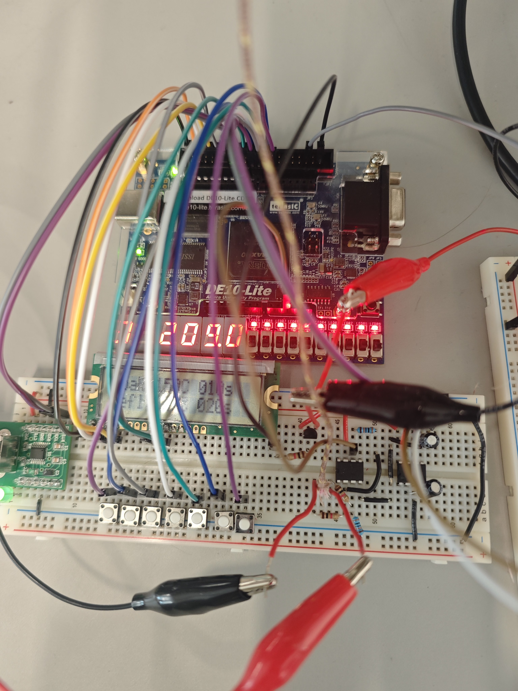
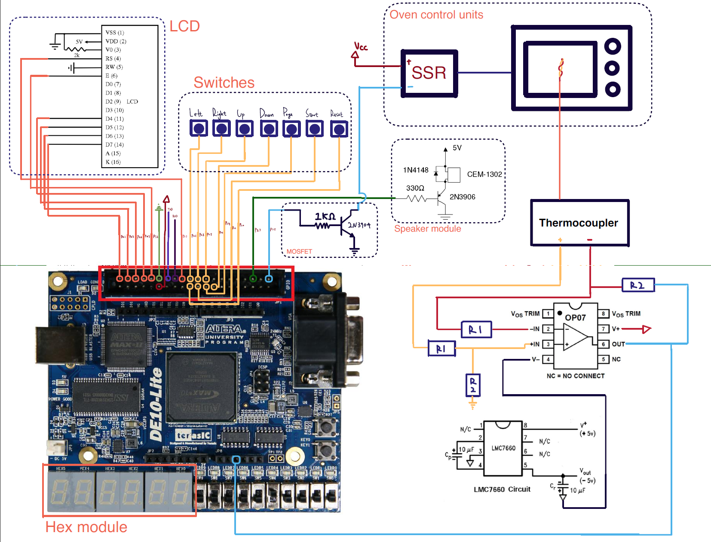
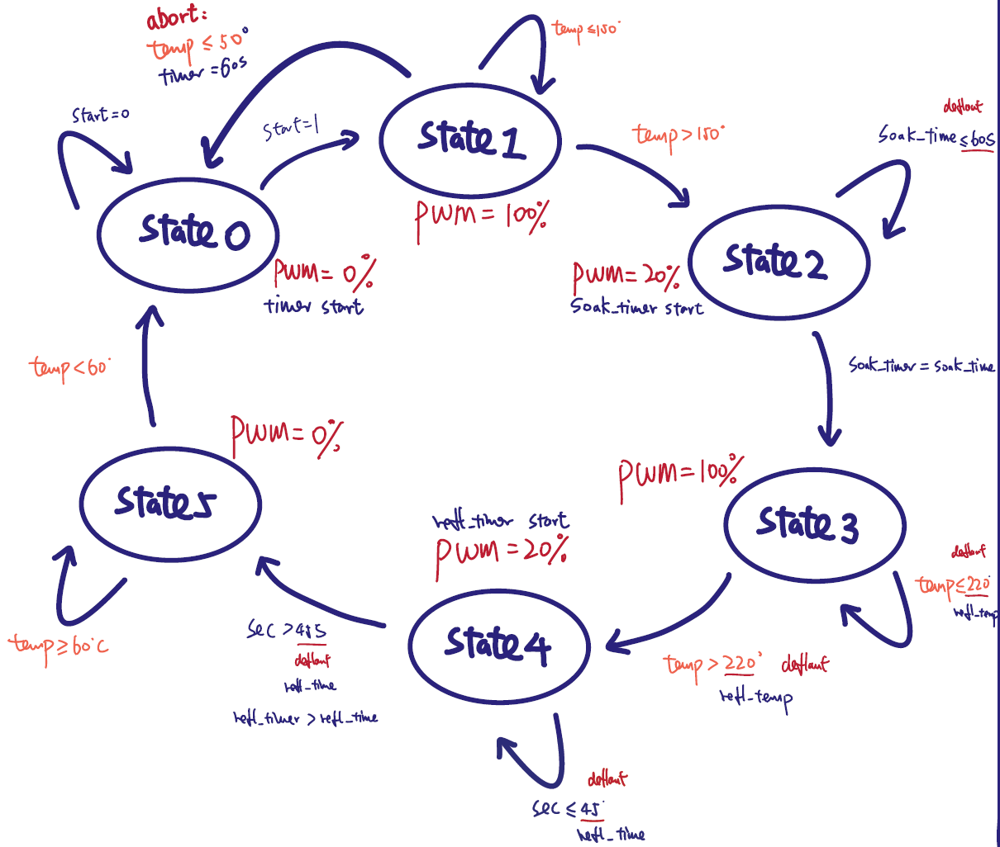

# FPGA-Based Reflow Oven Control System

An embedded reflow oven controller developed for **UBC ELEC 291 – Electrical Engineering Design Studio I**.

The system uses a **DE10-Lite FPGA running a CV-8052 processor**, with the main firmware written in **8051 assembly language**. It measures oven temperature using a K-type thermocouple, controls a toaster oven through a solid-state relay, and executes a complete solder reflow profile using a finite-state machine.

In addition to the core oven controller, the project includes an LCD user interface, seven-segment temperature display, pushbutton controls, UART communication, a Python monitoring GUI, real-time temperature plotting, CSV logging, and buzzer feedback.

<p align="center">
  
</p>

<p align="center">
  <i>Final hardware prototype during system testing.</i>
</p>

---

## Demo

A video presentation and demonstration of the completed system is available here:

[](https://www.youtube.com/watch?v=hFFiqIETEzM)

---

## Project Overview

Commercial PCB assembly commonly uses a controlled reflow temperature profile to melt solder paste without overheating the PCB or its components.

The goal of this project was to build a controller capable of automatically operating a toaster oven through the major stages of a reflow cycle:

1. Ramp to soak temperature
2. Soak
3. Ramp to reflow temperature
4. Reflow
5. Cooling

The controller continuously measures the oven temperature and determines the required heater power based on the current state of the reflow process.

The completed system combines:

- Embedded control
- Analog temperature sensing
- ADC conversion
- Finite-state-machine design
- Interrupt-based timing
- Solid-state relay power control
- LCD and pushbutton interaction
- UART communication
- PC-side monitoring and logging

---

## System Architecture

<p align="center">
  
</p>

The overall system is divided into four major functional blocks:

| Block | Purpose |
|---|---|
| Temperature sensing | Measures oven temperature using a K-type thermocouple and OP07 amplifier |
| Embedded controller | Executes temperature conversion, FSM logic, timing, UI and safety functions |
| Power control | Controls the toaster oven through an SSR using 0%, 20% and 100% power modes |
| PC interface | Sends profile parameters and receives live temperature data over UART |

A simplified signal path is:

```text
K-Type Thermocouple
        │
        ▼
OP07 Difference Amplifier
        │
        ▼
MAX10 ADC Channel 2
        │
        ▼
CV-8052 Embedded Controller
   │        │        │
   │        │        └──── UART ────► Python GUI
   │        │
   │        └─────────────► LCD / 7-Segment / Buzzer
   │
   ▼
Power Control
   │
   ▼
Transistor Driver
   │
   ▼
Solid-State Relay
   │
   ▼
Toaster Oven
```

---

# Hardware

## Main Components

| Component | Function |
|---|---|
| Terasic DE10-Lite | FPGA development platform |
| CV-8052 processor | Executes the oven-control firmware |
| K-Type thermocouple | High-temperature sensing |
| OP07 op-amp | Amplifies the thermocouple voltage |
| LMC7660 | Generates the negative supply required by the OP07 |
| MAX10 ADC | Digitizes the amplified thermocouple voltage |
| Solid-State Relay | Switches AC power to the toaster oven |
| 2N3904 transistor | Provides reliable SSR control from the MCU output |
| 16×2 LCD | Displays profile parameters and system status |
| Pushbuttons | User interface and profile adjustment |
| Seven-segment display | Displays measured temperature and FSM state |
| Buzzer | State-change, warning and completion feedback |
| USB-UART adapter | Communication between controller and PC |

---

## Temperature Measurement

A K-type thermocouple generates approximately:

$$V_{TC} \approx 41\ \mu V/^\circ C$$

Because this signal is only on the order of microvolts per degree Celsius, it cannot be used directly by the ADC.

An **OP07 low-offset operational amplifier** is therefore used to amplify the thermocouple voltage before it reaches the DE10-Lite ADC.

The theoretical amplifier gain was designed around:

$$G=\frac{R_2}{R_1}\approx300$$

During hardware validation, however, the actual resistor values were measured with a laboratory multimeter.

The measured resistor ratio was approximately:

$$G_{\text{measured}}\approx304$$

Using the measured gain instead of the nominal resistor values significantly improved the agreement between the embedded temperature calculation and the reference measurement.

The final temperature calculation therefore uses the amplified ADC signal and the measured amplifier gain.

The simplified conversion is:

$$\Delta T \approx \frac{V_{ADC}}{304 \times 41\ \mu V/^\circ C}$$

For the final implementation, a constant room-temperature approximation of **22°C** was used:

$$T_{oven}\approx22^\circ C+\Delta T$$

Earlier versions of the hardware investigated LM335/LM4040-based cold-junction compensation. Testing showed that the additional circuitry did not provide a meaningful improvement in the final validation result, so the simpler 22°C reference was retained.

---

## Amplifier Debugging

Temperature measurement was one of the largest hardware challenges in the project.

The original system frequently produced temperature errors above the required ±3°C tolerance.

Several possible causes were investigated:

- OP07 input offset
- Resistor tolerance
- Incorrect amplifier gain
- Cold-junction compensation
- ADC conversion error
- Software temperature calculation
- Aging or damaged analog components

The actual resistor values were measured instead of relying on their colour-coded values. This changed the effective amplifier gain used by the firmware from approximately **300 to 304**.

The OP07 was also replaced during debugging after inconsistent measurements suggested that the original component may have degraded after repeated laboratory use.

After these changes, the temperature measurement became significantly more stable.

---

# Oven Power Control

The toaster oven is powered through a solid-state relay rather than directly from the controller.

The MCU controls the SSR through output pin:

```text
P1.5 → transistor driver → SSR → toaster oven
```

A transistor driver was used because directly driving the SSR from an I/O pin was found to be less reliable during testing.

The firmware implements three heater power modes:

| Power Mode | Behaviour |
|---:|---|
| 0% | SSR always OFF |
| 20% | SSR ON for 200 ms and OFF for 800 ms |
| 100% | SSR continuously ON |

The 20% mode uses time-proportional control rather than high-frequency PWM because the controlled load is a thermal system.

```text
1 second power window

20% power:
[ ON ][------ OFF ------]
 200ms       800ms
```

The power timing is generated by the Timer0 interrupt and therefore does not block the main program.

---

# Reflow Finite-State Machine

The complete oven process is implemented as a six-state finite-state machine.

<p align="center">
  
</p>

| State | Stage | Heater Power | Transition |
|---|---|---:|---|
| `ST0` | Idle | 0% | START pressed |
| `ST1` | Ramp to Soak | 100% | Temperature reaches soak setpoint |
| `ST2` | Soak | 20% | Soak timer expires |
| `ST3` | Ramp to Reflow | 100% | Temperature reaches reflow setpoint |
| `ST4` | Reflow | 20% | Reflow timer expires |
| `ST5` | Cooling | 0% | Oven cools to safe temperature |

The profile parameters are adjustable by the user before starting a run.

Default values used by the PC interface are:

| Parameter | Default |
|---|---:|
| Soak temperature | 150°C |
| Soak time | 90 s |
| Reflow temperature | 230°C |
| Reflow time | 40 s |

When START is pressed, the selected parameters are copied into an **active profile**. This prevents accidental profile changes from affecting a reflow process that is already running.

---

## Safety Abort

The controller contains an additional temperature-rise safety check.

If the oven has not reached at least approximately **50°C during the first 60 seconds**, the run is aborted and heater power is disabled.

This helps detect situations such as:

- Thermocouple not positioned correctly
- Heater not operating
- Sensor or wiring failure
- Unexpected system behaviour

STOP and RESET inputs are also checked before normal FSM processing so the system can immediately disable the oven.

---

# Non-Blocking Firmware Architecture

One of the major design challenges was allowing several features to operate simultaneously without interfering with oven control.

Early implementations using blocking delays caused noticeable responsiveness problems, particularly when LCD updates, UART communication and buzzer functions were active at the same time.

The final firmware therefore uses an interrupt-driven, non-blocking structure.

```text
                    ┌─────────────────┐
                    │   Timer0 ISR    │
                    │     1 ms        │
                    └────────┬────────┘
                             │
             ┌───────────────┴───────────────┐
             │                               │
         200 ms flag                     1 s flag
             │                               │
             ▼                               ▼
   Temperature Sampling                 FSM Update
   Button Polling                       State Timing
   LCD/UI Updates                       Reflow Timing
```

The main loop continuously services independent modules:

```text
MAIN_LOOP
│
├── Service UART receiver
├── Parse completed UART commands
├── Handle 200 ms tasks
│   ├── Read temperature
│   ├── Scan buttons
│   └── Update UI
│
├── Handle 1 second tasks
│   └── Execute FSM step
│
├── Update buzzer scheduler
└── Render current LCD page
```

This architecture allows the controller to remain responsive while temperature sensing, communication, display updates and oven control operate concurrently.

---

# Timing System

Timer0 generates a **1 ms system tick**.

Two software timing references are derived from this interrupt:

| Timing Flag | Used For |
|---|---|
| 200 ms | Temperature sampling, button polling and display updates |
| 1 s | FSM transitions and reflow-stage timing |

The same timer also manages the time-proportional SSR output.

A second timer is used independently to generate buzzer frequencies.

UART baud generation is handled by Timer2.

---

# LCD and Physical User Interface

The controller includes a button-driven LCD interface.

The physical controls allow the operator to:

- Move between configurable parameters
- Increase/decrease values
- Change display pages
- Start a reflow cycle
- Stop/reset the controller

The firmware uses edge detection rather than waiting for a button to be released, which prevents button handling from blocking the rest of the system.

### Profile Screen

```text
Soak: 150 C 090 S
Refl: 230 C 040 S
```

### Running / Status Screen

```text
Time: XXmXXs
State: X
```

The DE10-Lite seven-segment displays simultaneously show the measured temperature and current FSM state.

---

# UART Communication

The controller communicates with the PC at:

```text
115200 baud
8-bit UART
```

UART reception is interrupt driven.

Received characters are placed into a **32-byte ring buffer in XDATA**, allowing incoming communication to be captured without blocking the oven-control loop.

The main loop later reconstructs complete newline-terminated commands and parses them.

Example profile commands:

```text
ST=150
SD=090
RT=230
RD=040
```

Where:

| Command | Meaning |
|---|---|
| `ST` | Soak temperature |
| `SD` | Soak duration |
| `RT` | Reflow temperature |
| `RD` | Reflow duration |

Temperature data is sent back to the PC as formatted ASCII:

```text
T=023.6
T=024.1
T=025.0
...
```

---

# Python Monitoring Interface

A PC-side application was developed using:

- Python
- Tkinter
- PySerial
- Matplotlib
- CSV

<p align="center">
  
</p>

The GUI allows the user to:

- Configure soak temperature
- Configure soak duration
- Configure reflow temperature
- Configure reflow duration
- Send the complete profile over UART
- Monitor current oven temperature
- Display a live temperature graph
- Start and stop data recording
- Save measurements automatically to CSV

The program polls the serial connection every **50 ms** and refreshes the graph every **200 ms**.

Temperature logs are automatically saved using timestamped filenames:

```text
reflow_log_YYYYMMDD_HHMMSS.csv
```

with the format:

```csv
time_s,temperature_C
0.000,22.4
1.003,23.1
2.006,24.0
...
```

---

# Audible Feedback

A buzzer provides additional feedback without requiring the operator to continuously watch the display.

Two feedback modes are implemented:

### Short Beep

Used during events such as:

- State transitions
- User interaction
- Start events

### Melody

A multi-note melody based on *Twinkle Twinkle Little Star* is generated using timer-driven note frequencies.

The melody is used for completion and abort feedback.

The buzzer scheduler is also non-blocking so sound generation does not interrupt oven control.

---

# Temperature Validation

Temperature measurement accuracy was experimentally validated against laboratory measurement equipment.

<p align="center">
  
</p>

The thermocouple was heated over a wide temperature range and the embedded-system measurement was compared against a reference measurement.

### Final Validation Result

| Metric | Result |
|---|---|
| Tested temperature range | approximately 53.5°C – 245.5°C |
| Test duration | approximately 220 s |
| Required maximum error | ±3°C |
| Observed maximum final error | approximately 2.88°C |
| Validation | **PASS** |

The final system remained within the required ±3°C accuracy tolerance throughout the validation range.

This result was achieved after several rounds of hardware and software debugging, including:

1. Measuring actual resistor values
2. Correcting amplifier gain in firmware
3. Replacing the OP07
4. Comparing ADC measurements with external reference data
5. Simplifying the cold-junction approximation
6. Re-testing across the full operating range

---

# Engineering Challenges

## 1. Temperature Measurement Accuracy

**Problem:**  
The initial thermocouple measurement frequently differed from the reference temperature by more than 3°C.

**Investigation:**

- Checked thermocouple wiring
- Examined OP07 offset
- Measured actual resistor values
- Tested LM335/LM4040 compensation
- Revisited ADC conversion calculations
- Replaced the OP07

**Solution:**  
The measured resistor ratio was used in the software instead of nominal values, changing the amplifier gain correction from approximately 300 to 304. Replacing the OP07 further stabilized the measurement.

---

## 2. Blocking Code

**Problem:**  
Busy-wait delays caused slow LCD response and could interfere with UART communication and STOP handling.

**Solution:**  
The program was reorganized around Timer0-generated flags and counters.

This allowed:

```text
FSM
UART
LCD
Buttons
Temperature Sampling
Buzzer
SSR Control
```

to operate without long blocking delays.

---

## 3. UART and Embedded Memory

**Problem:**  
UART reception needed to remain reliable while the controller was simultaneously performing real-time control tasks.

**Solution:**  
UART receive processing was split into two stages:

```text
Serial ISR
   │
   ▼
XDATA Ring Buffer
   │
   ▼
Main-Loop UART Service
   │
   ▼
Command Parser
```

The interrupt only captures incoming bytes while the main loop performs the heavier parsing work.

---

## 4. Hardware Integration

The final system involved a large number of connections between:

- FPGA development board
- LCD
- Seven pushbuttons
- Analog temperature circuit
- UART adapter
- SSR
- Transistor driver
- Buzzer

Several I/O assignments were changed during testing after discovering that some original pin configurations did not operate reliably with the SSR.

This required repeated hardware testing and rewiring before the final pin configuration was established.

---

# Pin Assignment

| Function | Pin |
|---|---|
| LCD RS | `P1.7` |
| LCD E | `P1.1` |
| LCD D4 | `P0.7` |
| LCD D5 | `P0.5` |
| LCD D6 | `P0.3` |
| LCD D7 | `P0.1` |
| Left Button | `P2.0` |
| Right Button | `P2.1` |
| Up Button | `P2.2` |
| Down Button | `P2.3` |
| Page Button | `P2.4` |
| Start Button | `P2.5` |
| Reset Button | `P2.6` |
| SSR | `P1.5` |
| Buzzer | `P3.7` |
| Temperature | MAX10 ADC Channel 2 |

---

# Software Structure

The main firmware is written in 8051 assembly.

```text
Main.asm
│
├── GPIO / Peripheral Setup
│
├── Timer0
│   ├── 1 ms system tick
│   ├── 200 ms flag
│   ├── 1 second flag
│   └── SSR time-proportional control
│
├── Timer1
│   └── Buzzer tone generation
│
├── Timer2
│   └── UART baud-rate generation
│
├── ADC Temperature Measurement
│
├── Finite State Machine
│
├── LCD / Button UI
│
├── Seven-Segment Display
│
├── UART
│   ├── Serial ISR
│   ├── Ring buffer
│   ├── Command parser
│   └── Temperature transmission
│
├── Safety / Start / Stop / Reset
│
└── Buzzer / Melody Scheduler
```

---

# Repository Contents

| File | Description |
|---|---|
| [`Main.asm`](Main.asm) | Main 8051 assembly firmware |
| [`UARTPython.py`](UARTPython.py) | Python UART GUI, live plotting and CSV logging |
| [`LCD_4bit_DE10Lite_no_RW.inc`](LCD_4bit_DE10Lite_no_RW.inc) | 4-bit LCD driver |
| [`math32.asm`](math32.asm) | 32-bit arithmetic support routines |
| [`video presentation link.txt`](video%20presentation%20link.txt) | Project demonstration video |

---

# Running the PC Interface

## Requirements

Install Python 3 and the required packages:

```bash
pip install pyserial matplotlib
```

Tkinter is normally included with the standard Python installation on Windows.

---

## Serial Port

The current Python program uses:

```python
PORT = "COM10"
BAUD = 115200
```

Change `COM10` to the serial port assigned to the USB-UART adapter on your computer.

Then run:

```bash
python UARTPython.py
```

---

# Build Notes

The firmware targets the MAX10/CV-8052 environment used with the DE10-Lite.

`Main.asm` depends on:

```text
LCD_4bit_DE10Lite_no_RW.inc
math32.asm
```

Make sure these files are available in the assembler include path before building.

---

# Development Process

The system was developed incrementally rather than as one large program.

The project was divided into several independently tested blocks:

```text
Temperature Sensing
        │
        ▼
Temperature Validation
        │
        ▼
SSR Power Control
        │
        ▼
Finite State Machine
        │
        ▼
LCD + Buttons
        │
        ▼
UART Communication
        │
        ▼
Python Monitoring GUI
        │
        ▼
Buzzer / Feedback
        │
        ▼
Full System Integration
```

Testing each subsystem independently made it easier to isolate problems before combining the complete controller.

A significant part of the project involved integration and debugging rather than simply implementing individual features.

---

# Course

Developed as **Project 1: Reflow Oven Controller** for:

**ELEC 291 – Electrical Engineering Design Studio I**  
University of British Columbia  
Department of Electrical and Computer Engineering  
Winter 2025–26

---

## Team

Developed collaboratively as a five-person ELEC 291 project team.

The repository contains the final integrated firmware and PC-side software developed for the completed system.

---

## License

See [`LICENSE`](LICENSE) for repository licensing information.
